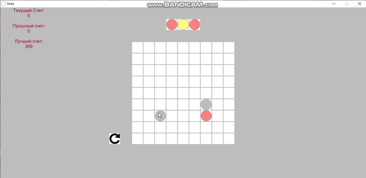

# About this repository
This project was created as a term paper.
This is a well-known game called "Lines". In this game the rules are simple: 
- You need to match 5+ balls in one line (vertical, horizontal and diagonal)
- The ball can be moved from point A to point B only if the ball path is clear (the ball moves only vertically and horizontally)
- The next three balls are shown at the top, which will appear in random places
- The goal of the game is to score the most points
- The game ends when there is no space left on the field for a new ball (that is, when the entire field is filled)
# demo
## Gameplay

## Move balls

## Game over

## Reset button

